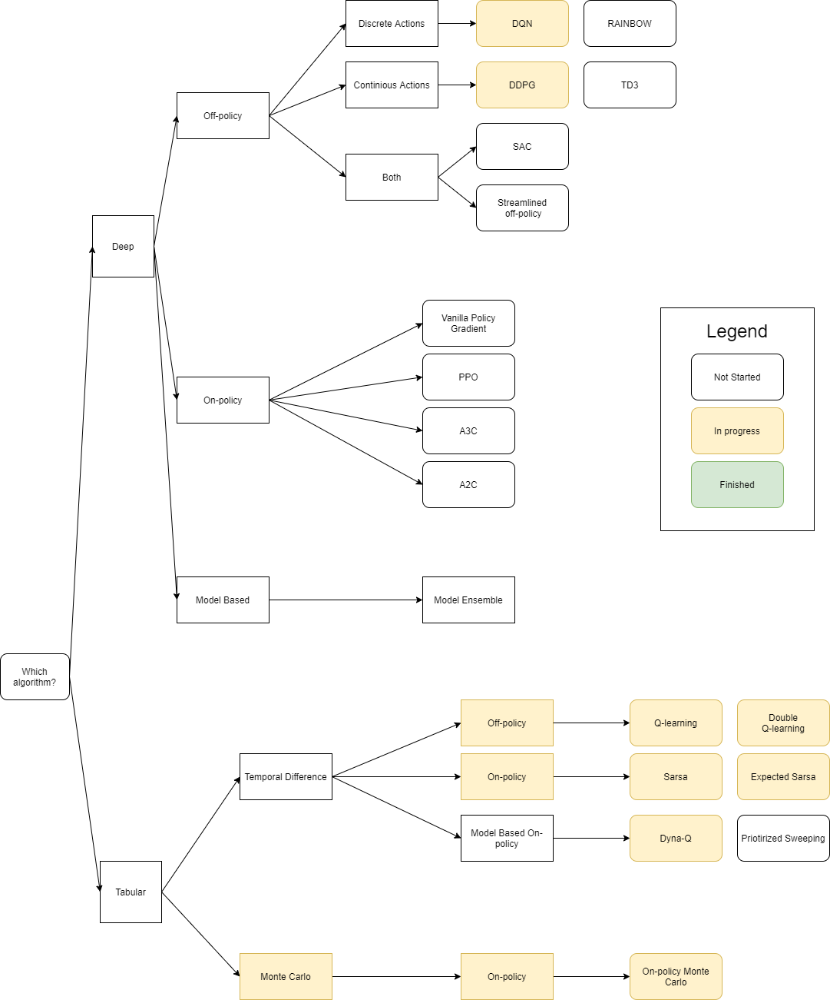

# Reinforcement-Learning-Think-Tank

This repository contains the implementation of various Reinforcement Learning algorithms
 
Goals:
+ Methods should be easy to extract/modify 
+ All theory behind the methods should be explained
+ All methods should have results shown to see if they work

The structure of methods will look as the image below.

Current implemented Tabular Algorithms:

+ Q-learning
+ Double Q-learning
+ Sarsa
+ Expected Sarsa
+ Dyna-Q
+ On-policy Monte Carlo Control

Current implemented Deep Algorithms:

+ DQN
+ DDPG

Example of usage for Tabular methods:

"""
python main.py --method Qlearning --env FrozenLake-v0 
"""

Example of usage for DeepRLMethods:

"""
python main.py --method DeepQLearning --env LunarLander-v2 
"""

Requirements:
+ gym
+ pytorch (only for deep rl methods)

Contributors: Lenmazpi, Tomeu7 